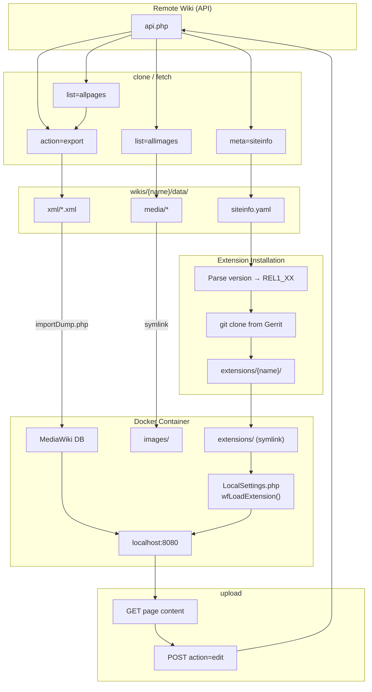

# Architecture

This document describes how each command works at a technical level.

---

## Data Flow Overview



---

## Commands

### `clone`

**Purpose**: Initialize a new wiki project by exporting all content from a remote wiki.

**Flow**:
1. **Create directory**: `wikis/{name}/` with `data/`, `extensions/` subdirs
2. **Run exporter** (subprocess): `exporter/main.py --scope all --format xml`
3. **Query siteinfo** (inside exporter):
   ```
   GET /api.php?action=query&meta=siteinfo&siprop=general|extensions
   ```
   - Saves `siteinfo.yaml` with: `sitename`, `mediawiki_version`, `extensions[]`
4. **Discover all pages**:
   ```
   GET /api.php?action=query&meta=siteinfo&siprop=namespaces  # Get namespace list
   GET /api.php?action=query&list=allpages&apnamespace={ns}&aplimit=max  # Per namespace
   ```
5. **Export to XML** (batched):
   ```
   GET /api.php?action=query&titles={batch}&export=1&exportnowrap=1
   ```
   - Saves `xml/export_{offset}.xml`
6. **Download images** (if not skipped):
   ```
   GET /api.php?action=query&list=allimages&aiprop=url|sha1&ailimit=max
   ```
   - Compares SHA1 hash to cached version
   - Downloads only changed files
7. **Resolve extensions**: Query mediawiki.org for each extension, check Gerrit availability
8. **Install extensions**: Clone from Gerrit using matching `REL1_XX` branch
9. **Start Docker**: Set `MW_VERSION` env var, run `docker-compose up -d`
10. **Import to container**: Run `manager.py import` for XML import

**API Data Obtained**:
| Endpoint | Data Used | Data Available (Not Yet Used) |
|----------|-----------|-------------------------------|
| `meta=siteinfo&siprop=general` | `generator` (version), `sitename` | `mainpage`, `base`, `phpversion`, `dbtype`, `lang` |
| `meta=siteinfo&siprop=extensions` | Extension names | `version`, `author`, `url`, `descriptionmsg` |
| `meta=siteinfo&siprop=namespaces` | Namespace IDs | `canonical`, `*` (localized name) |
| `list=allpages` | Page titles | — |
| `action=query&export` | Full page XML | — |
| `list=allimages` | `url`, `sha1` | `size`, `width`, `height`, `mime`, `timestamp` |

---

### `fetch`

**Purpose**: Download remote changes to staging area (`.tmp/`) without modifying live data.

**Flow** (`SyncEngine.fetch`):
1. **Discard previous incomplete fetch** (remove `.tmp/` if exists)
2. **Run exporter** to `.tmp/data/` with `skip_media=True`
3. **Parse XML** from both `data/xml/` (local) and `.tmp/data/xml/` (remote)
4. **Compare revision IDs**:
   - For each page: compare `remote_revid` vs `base_revid` and `local_revid`
   - Classify as: `new`, `modified`, `conflict`, `deleted`
5. **Save state** to `.tmp/sync_state.yaml`

**Conflict Detection Logic**:
```python
if remote_rev != base_revid:
    if local_rev != base_revid:
        status = 'conflict'  # Both changed
    else:
        status = 'modified'  # Only remote changed
```

---

### `pull`

**Purpose**: Merge fetched changes from `.tmp/` into live data.

**Flow** (`SyncEngine.pull`):
1. **Load temp state** from `.tmp/sync_state.yaml`
2. **For each page**:
   - `new`: Copy from `.tmp/` to `data/`
   - `modified`: Overwrite local with remote (remote wins)
   - `conflict`: Attempt three-way merge with `diff3`, create `.conflict` file if fails
3. **Update `sync_state.yaml`** with new `base_revid` values
4. **Remove `.tmp/`**

---

### `push`

**Purpose**: Upload local changes back to remote wiki.

**Flow** (`cmd_push`):
1. **Detect local changes** (`SyncEngine.get_local_changes`):
   ```
   GET http://localhost:8080/api.php?action=query&generator=allpages&prop=revisions&rvprop=ids
   ```
   - Compare current revision IDs vs stored `local_revid`
2. **For each modified page**:
   - Get content from local wiki:
     ```
     GET http://localhost:8080/api.php?action=query&titles={title}&prop=revisions&rvprop=content
     ```
   - Push to remote:
     ```
     POST /api.php action=edit&title={title}&text={content}&token={csrf}
     ```
3. **Update `sync_state.yaml`** with new `local_revid`

---

### `sync`

**Purpose**: Import exported data into the Docker container.

**Flow**:
1. Run `manager.py install` – executes MediaWiki's `install.php`
2. Run `manager.py import` – executes `importDump.php` for each XML file
3. Call `SyncEngine.update_local_revisions()` – queries local wiki for all page revisions, saves to `sync_state.yaml`

---

### `status`

**Purpose**: Display current state of the wiki environment.

**Checks performed**:
1. Active wiki from `wikis.yaml`
2. Docker container running (via `docker ps`)
3. Synced wiki from `portable_wiki/.sync_state`
4. Last sync timestamp
5. Extensions resolved count
6. Pending fetch (`.tmp/` exists?)
7. Local changes (queries local API if container running)
8. Conflict files in `conflicts/`

---

### `start`

**Purpose**: Start Docker containers with version-matched MediaWiki image.

**Flow**:
1. Load `siteinfo.yaml` from active wiki's data dir
2. Parse `mediawiki_version` (e.g., `1.39.0` → `1.39`)
3. Set `MW_VERSION` environment variable
4. Run `docker-compose up -d` (inherits env var)

---

## State Files

| File | Location | Purpose |
|------|----------|---------|
| `wikis.yaml` | Project root | Wiki configurations (url, path, credentials) |
| `siteinfo.yaml` | `wikis/{name}/data/` | Remote wiki version and extension list |
| `sync_state.yaml` | `wikis/{name}/` | Per-page revision tracking (`base_revid`, `local_revid`, `remote_revid`) |
| `extensions.lock` | `wikis/{name}/` | Resolved extension statuses (bundled, archived, available) |
| `.sync_state` | `portable_wiki/` | Currently synced wiki name |

---

## Extension Resolution

**Decision tree for each extension**:
```
Extension Name
     │
     ▼
Query mediawiki.org/wiki/Extension:{name}
     │
     ├─ Contains {{Bundled|1.X}} → SKIP (already in core)
     │
     ├─ Contains {{Archived extension}} → Check Gerrit
     │     │
     │     ├─ Exists on Gerrit → CLONE (may still work)
     │     └─ Not on Gerrit → PROMPT for alternative
     │
     └─ Extension page exists → CLONE from Gerrit
```

**Branch selection**:
- Read `mediawiki_version` from `siteinfo.yaml`
- Convert to branch name: `1.39.0` → `REL1_39`
- Try in order: `REL1_39`, `REL1_45`, `REL1_44`, `REL1_43`, `master`
